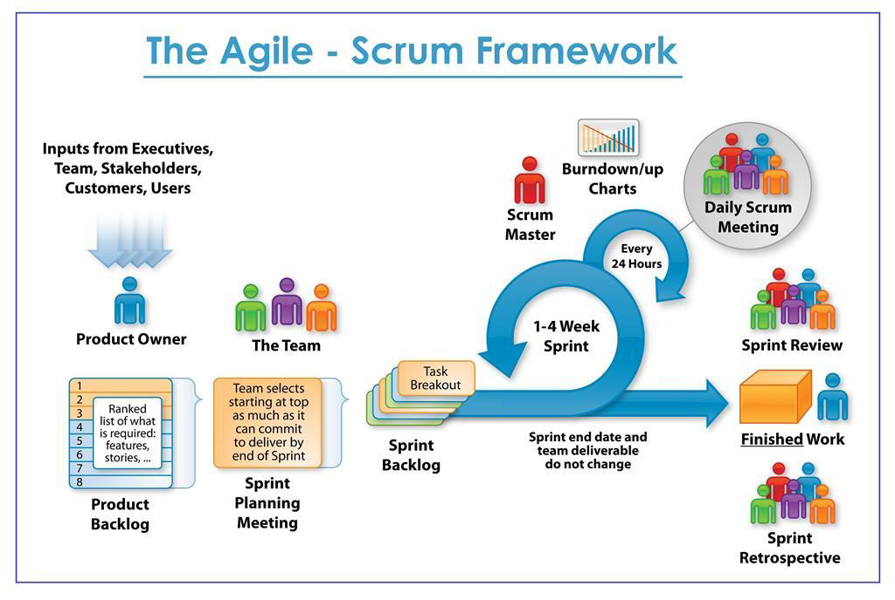

# Quality Assurance

> I'm learning Quality Assurance, I will be using this repo to document my journey, 
share my notes with others and demonstrate my knowledge to potential employers.

# Table of Contents

## Software Testing Concepts

1. [What is Software Testing](#what-is-software-testing)

2. [Software Development Livecyle](#software-development-livecyle)

    1. [Sequential Development](#sequential-development)
        - [The Waterfall Model](#the-waterfall-model)
        - [The V-Model](#the-v-model)

    2. [Interactive & Incremental]() 
        - [Agile | software development](#agile--software-development)
        - [Scrum | The Agile - Scrum Framework](#scrum--the-agile---scrum-framework)

3. [Test Processes](#test-processes) 

4. [Testing Types](#testing-types)

## Technologies used for Quality Assurance and Software Testing

1. Programming languages

2. Test Automation Frameworks

3. API Testing

4. Project | Test management Tools 

5. Continuous Integration and Deployment (CI/CD) tools

6. Performance Testing Tools tools

7. Virtualization and Containerization Tools

8. Database Testing

9. Version Control

--- 

# What is Software Testing
> Software testing is a way to assess the quality of the software, reduce the risk of software failure in operation. Software testing is a process which includes many different activities and execution is only one of these activities, Software Testing ≠ Test Execution.

# Software Development Livecyle

## Sequential Development: 
> A sequential development model describes the software development process as a linear, sequential flow of activities. This means that any phase in the development process should begin when the previous phase is complete. In theory, there is no overlap of phases, but in practice, it is beneficial to have early feedback from the following phase

## The Waterfall Model:
> In the Waterfall model, the development activities are completed one after another. In this model, test activities only occur after all other development activities have been completed.
1. Requirements
2. Design
3. Build
4. Test and fix 
5. Release to customers

## The V-Model
> Unlike the Waterfall model, the V-model integrates the test process throughout the development process, implementing the principle of early testing.

---

## Interactive & Incremental
> Examples of Interactive & Incremental  models. Note: you can have model that’s Interactive & Incremental at the same time, the most famous example is scrum.

## Agile | software development
> Agile is a...

## Scrum | The Agile - Scrum Framework
> Scrum is an Agile Framwork.. 

--- 
# Test Processes 
1. Test Scenarios

2. Test Case Writting

3. Test Execution

4. Bug Reporting

5. Testing Reports: Test Progress & Test Summary Report 

---
# Testing Types