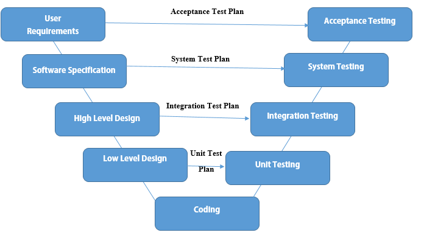
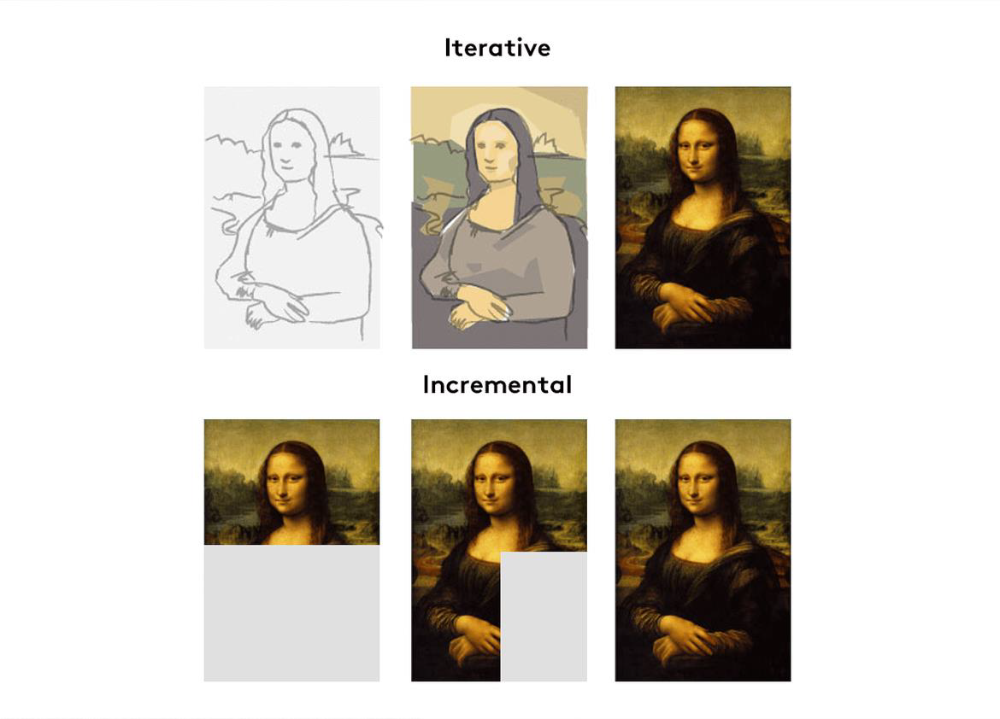

# Quality Assurance

> I'm learning Automated Quality Assurance, I will be using this repo to document my journey, 
share my notes with others and demonstrate my knowledge to potential employers.

# Software Testing Concepts Table of Contents

1. [What is Software Testing](#what-is-software-testing)
    - [Dynamic vs Static  vs Validation vs Verification Testing](#dynamic-vs-static-vs-validation-vs-verification-testing)
    - [Objectives of Testing](#objectives-of-testing)

2. [Software Development Livecyle](#software-development-livecyle)

    1. [The software development life cycle (SDLC) Processes](#the-software-development-life-cycle-sdlc-processes)

    2. [Sequential Development](#sequential-development)
        - [The Waterfall Model](#the-waterfall-model)
        - [The V-Model](#the-v-model)

    2. [Interactive & Incremental](#interactive--incremental) 
        - [Agile | software development](#agile--software-development)
            - [Agile Frameworks](#agile-frameworks)
        - [Scrum | The Agile Framework](#scrum--the-agile-framework)

3. [Test Processes](#test-processes) 
    - [Test Processes Activities](#test-processes-activities)
    - [Test Levels](#test-levels)

4. [Testing Types](#testing-types)

5. [Technologies used for Quality Assurance and Software Testing](#technologies-used-for-quality-assurance-and-software-testing)

--- 
# What is Software Testing
> Software testing is a way to assess the quality of a software, system or application and to detect any errors, bugs, defects, or other issues that may affect its functionality, performance, and overall quality. Software testing is a process which includes many different activities, It involves running the software, system or application with the intention of finding faults or defects, and comparing the actual results against the expected results to identify discrepancies.

## Dynamic vs Static  vs Validation vs Verification Testing 

## Objectives of Testing
1. Requirements Fulfillment
2. Preventing & Find Defects
3. Reduce Risk
4. Compliance with Laws
5. Building Confidence
6. Providing Information to Stakeholders

--- 

# Software Development Livecyle
> The software development life cycle (SDLC) is a structured process used by software development teams to design, build, test, and deploy high-quality software. SDLC describes the types of activities performed at each stage in a software development project, and how the activities relate to one another logically and chronologically.

## The software development life cycle (SDLC) Processes
1. Planning: the project scope, requirements, timelines, and resources are defined. This includes identifying the software objectives, user needs, and project constraints.

<!-- Analysis: the software requirements are analyzed and documented. This includes identifying the functional and non-functional requirements of the software. -->

2. Design: the software architecture, system design, and database design are developed. This includes creating a detailed design specification that outlines how the software will be built and how the different components will work together.

3. Implementation | Build: the software code is developed and tested. This includes coding, unit testing, integration testing, and debugging.

4. Testing | Fix: the software is tested to ensure that it meets the specified requirements and quality standards. This includes testing for functionality, performance, usability, security, and compatibility.

5. Deployment | Release: In this stage, the software is released to production and made available to end-users. This includes installation, configuration, and training.

## Sequential Development: 
> A sequential development model describes the software development process as a linear, sequential flow of activities. This means that any phase in the development process should begin when the previous phase is complete. In theory, there is no overlap of phases, but in practice, it is beneficial to have early feedback from the following phase

## The Waterfall Model:
> In the Waterfall model, the development activities are completed one after another. In this model, test activities only occur after all other development activities have been completed.
1. Requirements
2. Design
3. Build
4. Test and fix 
5. Release to customers

## The V-Model
> Unlike the Waterfall model, the V-model integrates the test process throughout the development process, implementing the principle of early testing.

## Interactive & Incremental 
> Examples of Interactive & Incremental  models. Note: you can have model that’s Interactive & Incremental at the same time, the most famous example is scrum

## Agile | software development
> Agile is a project management methodology that emphasizes flexibility, collaboration, and continuous improvement. It involves breaking down a project into small, manageable chunks called sprints, and working on them in short cycles. The goal is to deliver working software quickly and frequently, while continuously adapting to changing requirements and feedback. Agile encourages close collaboration between the development team, the stakeholders, and the customer to ensure that the final product meets the desired outcomes.

### Agile Frameworks 
1. Scrum: A popular framework that focuses on delivering working software incrementally and iteratively, with regular feedback and collaboration.

2. Kanban: A visual framework that focuses on continuous delivery, with a focus on limiting work in progress, and optimizing flow.

3. Lean: A framework that emphasizes continuous improvement, eliminating waste, and creating value for customers.

4. Extreme Programming (XP): A framework that focuses on delivering high-quality software through continuous testing, pair programming, and other practices.

5. Crystal: A family of agile frameworks that emphasizes the importance of communication, collaboration, and simplicity.

6. Dynamic Systems Development Method (DSDM): A framework that emphasizes the importance of active user involvement, frequent delivery, and a focus on business value.

7. Adaptive Software Development (ASD): A framework that emphasizes collaboration, feedback, and continuous learning and improvement.

## Scrum | The Agile Framework
> Scrum is an agile framework for managing and completing complex projects. It involves breaking down a project into short, fixed-length sprints, typically 2-4 weeks long. The development team works on the highest-priority items from the product backlog during each sprint, and holds daily stand-up meetings to coordinate their work. Scrum encourages transparency, inspection, and adaptation throughout the project, and relies on a self-organizing team to deliver high-quality software.

- [Read more](https://www.scrum.org/learning-series/what-is-scrum)
- [The Scrum guide](https://scrumguides.org/) 

--- 
# Test Processes 
>  Test processes refer to the series of activities and tasks that are carried out to ensure that software products and services meet the required standards and specifications.

## Test Processes Activities

1. Test planning: defining the scope of testing, identifying the testing goals and objectives, and determining the resources and timelines required for testing.

2. Test design: developing test cases, test scenarios, and test scripts that will be used to evaluate the software product's functionality, performance, and usability.

3. Test execution: running the tests that were designed in the previous stage, recording the results, and identifying defects and issues.

4. Test reporting: documenting the test results and sharing them with the relevant stakeholders, such as project managers, developers, and customers.

5. Test analysis: analyzing the test results and identifying trends, patterns, and issues that need to be addressed.

6. Test maintenance: updating the test cases and scripts as new features are added to the software product or as requirements change.

## Test Levels
> Test levels are groups of test activities that are organized and managed together. Each test level is an instance of the test process, test levels are related to other activities within the software development lifecycle.

1. Unit: Component testing (also known as unit or module testing) focuses on components that are separately testable (most of the time developer are responsible for it)
2. Integration: Integration testing focuses on interactions between components or systems
    1. There’s 2 type of Integration testing 
        1. Component Integration (also developer is responsible)
        2. System Integration (responsibility by tester)
3. System: System testing focuses on the behavior and capabilities of a whole system or product 
4. Acceptance: like system testing, typically focuses on the behavior and capabilities of a whole system or product. (Mostly done by users os stakeholders)
4. Alpha Testing: is done inside the organization
5. Beta Testing: is done by users at their location

---
# Testing Types
> There are several types of software testing that can be performed to ensure the quality of the software. Some of the most common testing types include: 

1. Functional testing: test a system functionality, e.g a web app login page
2. Non-functional testing: how the sys performs e.g speed, security etc…
3. Black-Box Testing: Testing without knowing the internal structure of the system or code
4. White-Box Testing: Testing while monitoring the internal structure of the system or code
5. Dynamic Testing: Testing that includes executing the software
6. Static Testing: Testing that doesn’t includes executing the software
7. Retesting (Confirmation Testing): Testing that doesn’t includes executing the software
8. Regression Testing: Testing unchanged areas to ensure they are not affected by changes
9. Smoke Testing: Testing main functionalities to ensure that the build is stable enough to continue testing

--- 
# Technologies used for Quality Assurance and Software Testing
> Through my research, I identified the diverse technologies utilized by Quality Assurance experts in software testing.

1. Programming languages
    - 

2. Test Automation Frameworks

3. API Testing

4. Project | Test management Tools 

5. Continuous Integration and Deployment (CI/CD) tools

6. Performance Testing Tools tools

7. Virtualization and Containerization Tools

8. Database Testing

9. Version Control